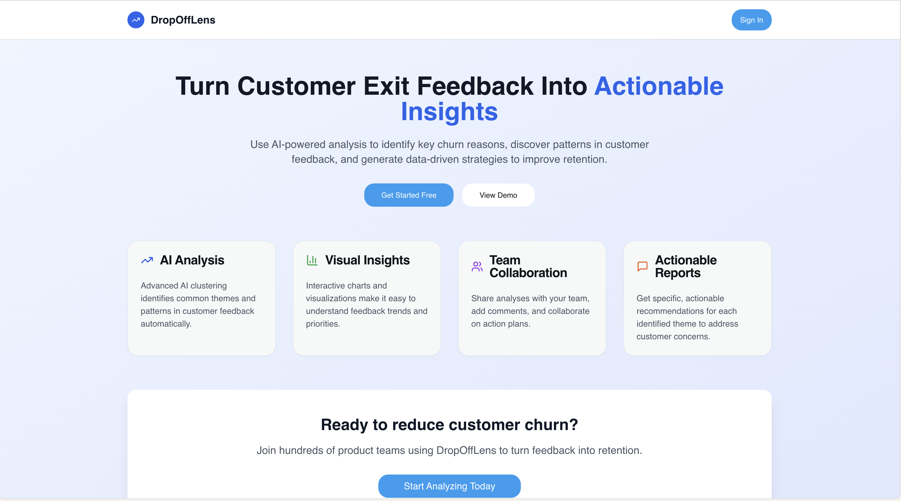

[](https://churn-lens-abhishekdhama18.replit.app/)


# DropOffLens

**AI-Powered Churn Feedback Analyzer for SaaS Teams**




---

##  Why This Exists

SaaS startups lose users every day—but rarely know *why*. Exit feedback is scattered and time-consuming to analyze. DropOffLens turns raw feedback into clear insights in seconds, helping teams fix churn drivers faster.

---

##  Features

- Upload or paste churn feedback (CSV or text input)
- AI-powered feedback clustering with GPT
- Visual dashboard for top churn themes
- Sample quotes and action suggestions per theme
- PDF summary export
- Clean, responsive React + Node.js stack
- Deployed and working live for instant testing

---

## 📚 Documentation

- [PRD (Product Requirements)](./docs/PRD.md)
- [User Personas](./docs/user-personas.md)
- [User Flow](./docs/user-flow.md)
- [User Stories](./docs/user-stories.md)
- [System Architecture](./docs/architecture.md)
- [Product Roadmap](./docs/roadmap.md)

---


##  Tech Stack

- **Frontend**: React + Vite + Tailwind CSS (inside `client/`)
- **Backend**: Node.js + Express + OpenAI (inside `server/`)
- **Shared Logic**: Common utils or helpers (`shared/`)
- **Deployment**: Replit environment (`.replit`)
- **Database/ORM**: Drizzle config used (optional persistence)

---

##  Setup & Run Locally

1. Clone the repo  
   `git clone https://github.com/abhishekk2305/DropOffLens.git`  
2. Install root packages  
   ```bash
   cd DropOffLens
   npm instal
3. Set your OpenAI API key in .env (create .env file with OPENAI_KEY=your_key)
4. Start the app
   npm run dev
5. Open http://localhost:3000 in your browser

---

## Usage Instructions / Demo

1. Enter feedback via upload or paste.
2. Click Analyze Feedback.
3. View themes, sample quotes, and AI-generated action suggestions.
4. Download PDF report using the Export button.

---

## Future Roadmap

- Multi-user collaboration and history tracking
- Native integration with Intercom, Zendesk, Airtable
- CSV export and email-sharing options
- Onboarding wizard for first-time users
- Customizable theme clusters by product teams

---

## 🎯 Why I Built This, Author

Hi, I’m Abhishek Dhama – a project management expert pivoting into product roles.  
I built DropOffLens to:

- Solve a **real retention pain point** I’ve seen across startups
- Show my ability to **think, plan, and ship like a PM**
- Demonstrate ownership from idea → build → delivery → docs

🧠 PM skills I’ve applied here:
- Problem validation
- MVP scoping
- User-centric documentation
- Technical collaboration with AI agents
- Product thinking, not just feature thinking

[LinkedIn](https://www.linkedin.com/in/abhishekkdhama/)
[GitHub](https://github.com/abhishekk2305)

---

## 💡 Key Product Learnings

- Shipping fast is better than perfect.
- AI is only useful when paired with clean UX.
- Even small tools can solve big problems if scoped correctly.

---

## Demo Link
[Try it live](https://churn-lens-abhishekdhama18.replit.app/)


   
